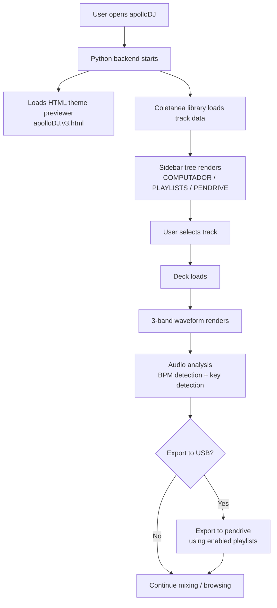
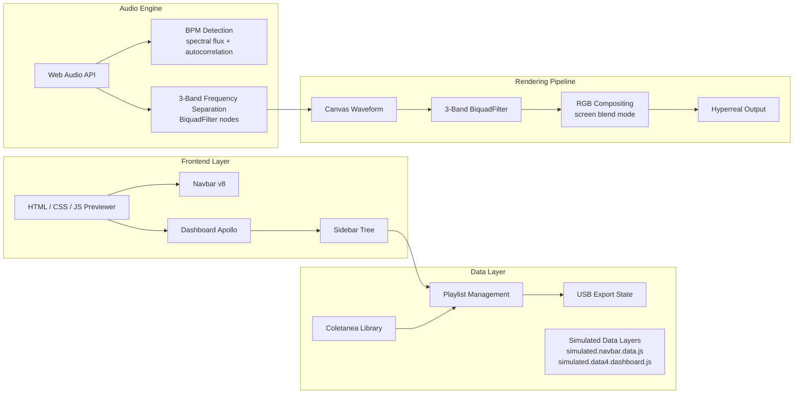
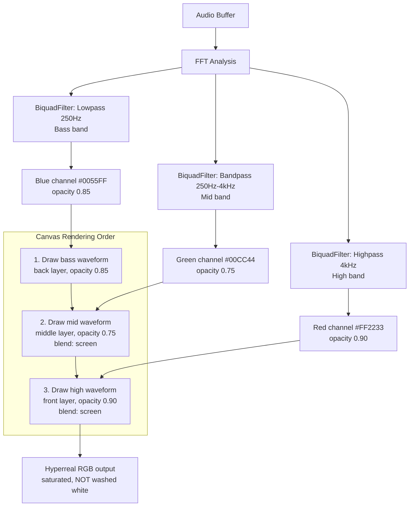
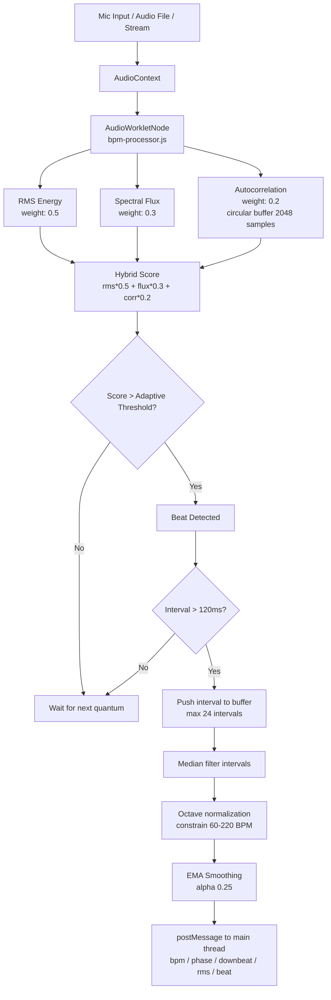
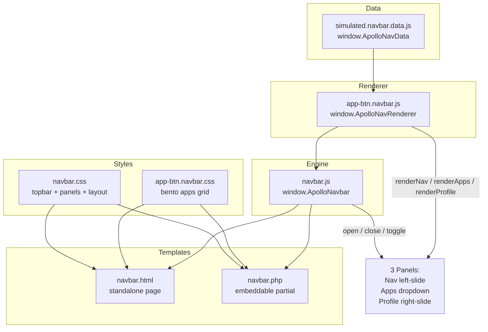
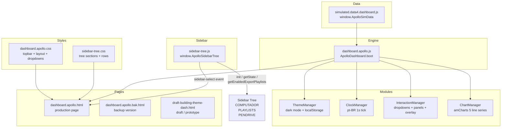
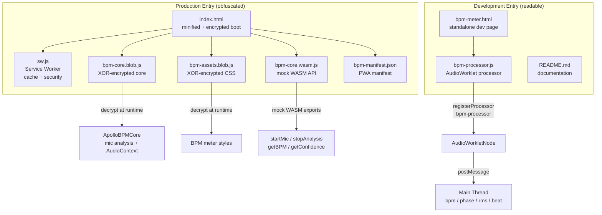
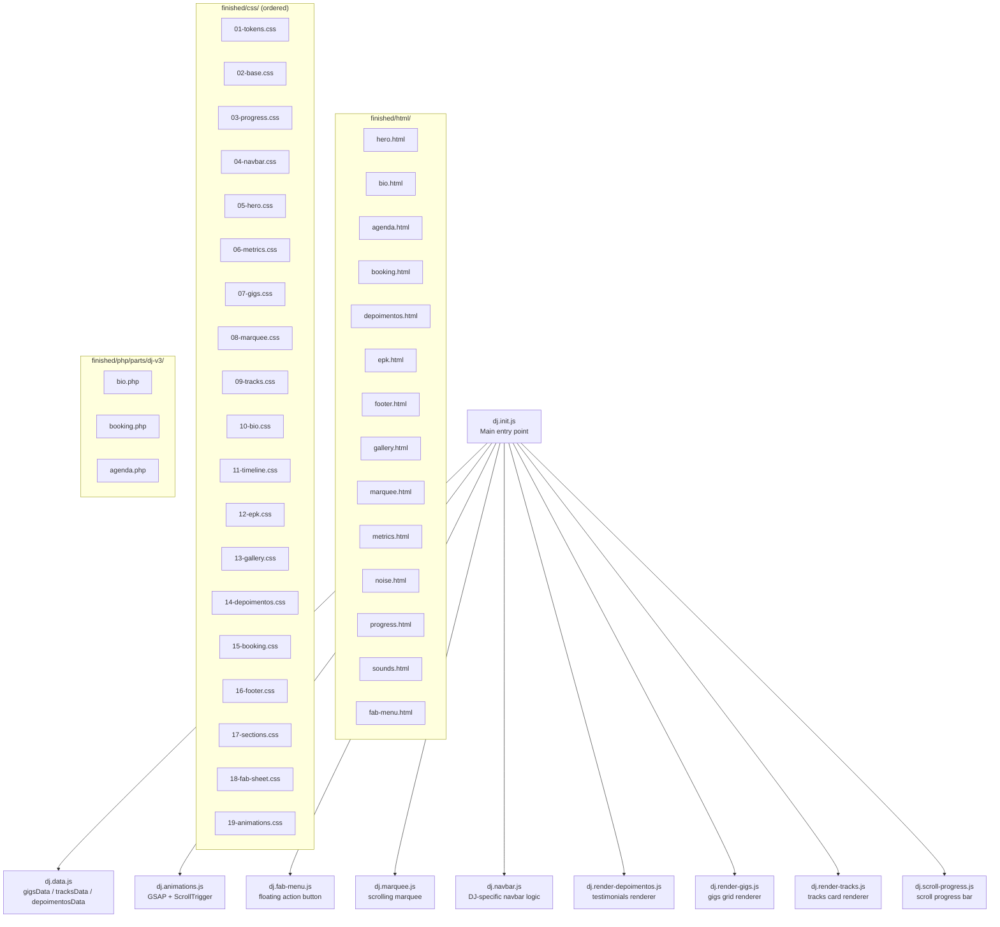

# Apollo DJ -- System Architecture Flowchart

> Mermaid diagrams describing the full Apollo DJ system:
> navbar, dashboard, BPM meter, sidebar tree, and CDJ screen-software theme previewer.

---

## 1. High-Level System Flow

---

## 2. Component Architecture

---

## 3. Waveform Pipeline Detail

---

## 4. BPM Detection Pipeline

---

## 5. Navbar Architecture

---

## 6. Dashboard Architecture

---

## 7. BPM Module Architecture

---

## 8. File Dependencies (complete)

```mermaid
graph TD
    subgraph CDN["External CDN"]
        CORE["cdn.apollo.rio.br/v1.0.0/core.js<br>GSAP + RemixIcon + Apollo Icons + Popper + jQuery"]
        HTMX["htmx.v2.0.8.js"]
        ALP["alpine.v.3.15.8.js"]
        FONTS["Google Fonts<br>Space Grotesk / Space Mono / Syne"]
        REMIX["Remix Icons 4.x"]
        AM5["amCharts 5"]
    end

    subgraph Root["Root Files"]
        UNI_CSS[universal.css<br>v3.2.0 design system]
        UNI_SHO[universal-showcase.html.bak.html<br>token showcase / backup]
    end

    subgraph Navbar["navbar/"]
        N_DATA[simulated.navbar.data.js]
        N_RENDER[app-btn.navbar.js]
        N_ENGINE[navbar.js]
        N_HTML[navbar.html]
        N_PHP[navbar.php]
        N_CSS[navbar.css]
        N_APP_CSS[app-btn.navbar.css]
    end

    subgraph Dash["DASH/"]
        D_HTML[dashboard.apollo.html]
        D_CSS[dashboard.apollo.css]
        D_JS[dashboard.apollo.js]
        D_BAK[dashboard.apollo.bak.html]
        D_DRAFT[draft-building-theme-dash.html]
        D_DATA[simulated.data4.dashboard.js]
        D_ST_CSS[sidebar-tree.css]
        D_ST_JS[sidebar-tree.js]
    end

    subgraph Bpm["BPM/"]
        B_METER[bpm-meter.html]
        B_PROC[bpm-processor.js]
        B_WASM[bpm-core.wasm.js]
        B_CORE[bpm-core.blob.js]
        B_ASSETS[bpm-assets.blob.js]
        B_MAN[bpm-manifest.json]
        B_SW[sw.js]
        B_IDX[index.html]
        B_README[README.md]
    end

    subgraph Dj["DJ/"]
        DJ_CSS[dj-page.css]
        DJ_JS[dj-page.js]
        DJ_INIT[finished/js/dj.init.js]
        DJ_DATA[finished/js/dj.data.js]
        DJ_ANIM[finished/js/dj.animations.js]
        DJ_FAB[finished/js/dj.fab-menu.js]
        DJ_MARQ[finished/js/dj.marquee.js]
        DJ_NAV[finished/js/dj.navbar.js]
        DJ_DEP[finished/js/dj.render-depoimentos.js]
        DJ_GIGS[finished/js/dj.render-gigs.js]
        DJ_TRKS[finished/js/dj.render-tracks.js]
        DJ_PROG[finished/js/dj.scroll-progress.js]
    end

    %% CDN dependencies
    CORE --> N_HTML
    CORE --> N_PHP
    CORE --> D_HTML
    CORE --> D_BAK
    CORE --> D_DRAFT
    FONTS --> B_METER
    FONTS --> B_IDX
    REMIX --> B_METER
    HTMX --> D_HTML
    ALP --> D_HTML
    AM5 --> D_JS

    %% Navbar chain
    N_DATA --> N_RENDER
    N_RENDER --> N_ENGINE
    N_CSS --> N_HTML
    N_APP_CSS --> N_HTML
    N_CSS --> N_PHP
    N_APP_CSS --> N_PHP

    %% Dashboard chain
    D_CSS --> D_HTML
    D_DATA --> D_JS
    D_JS --> D_HTML
    D_ST_CSS --> D_HTML
    D_ST_JS --> D_HTML

    %% BPM chain
    B_PROC --> B_METER
    B_WASM --> B_IDX
    B_CORE --> B_IDX
    B_ASSETS --> B_IDX
    B_MAN --> B_IDX
    B_SW --> B_IDX

    %% DJ chain
    DJ_DATA --> DJ_INIT
    DJ_ANIM --> DJ_INIT
    DJ_FAB --> DJ_INIT
    DJ_MARQ --> DJ_INIT
    DJ_NAV --> DJ_INIT
    DJ_DEP --> DJ_INIT
    DJ_GIGS --> DJ_INIT
    DJ_TRKS --> DJ_INIT
    DJ_PROG --> DJ_INIT
    UNI_CSS --> DJ_CSS

    %% Root dependencies
    CORE --> UNI_CSS
```

---

## 9. DJ Page Module Dependencies

